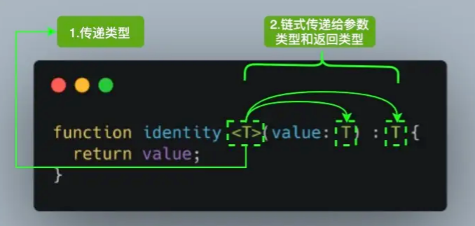
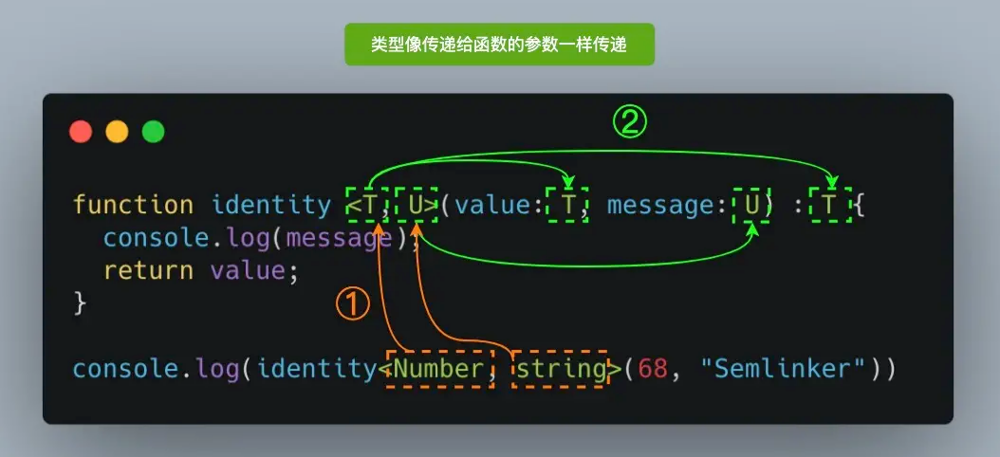

# TypeScript

## 一、简介

### 1. 什么 TypeScript

"TypeScript is JavaScript with syntax for types."  
"TypeScript 是一个使用了 types 类型的 JavaScript 语言。"

### 2. TypeScript 做了什么 (特性)

#### ① 类型系统

##### TypeScript 是静态类型

类型系统按照「类型检查的时机」来分类，可以分为动态类型和静态类型。  

- 动态类型是指在运行时才会进行类型检查，这种语言的类型错误往往会导致运行时错误。  
JavaScript 是一门解释型语言，没有编译阶段，所以它是动态类型。
- 静态类型是指编译阶段就能确定每个变量的类型，这种语言的类型错误往往会导致语法错误。    
TypeScript 在运行前需要先编译为 JavaScript，而在编译阶段就会进行类型检查，所以TypeScript 是静态类型。

##### TypeScript 是弱类型

类型系统按照「是否允许隐式类型转换」来分类，可以分为强类型和弱类型。

- TypeScript 是完全兼容 JavaScript 的，它不会修改 JavaScript 运行时的特性，所以它们都是弱类型。  
`举例:` 以下这段代码不管是在 JavaScript 中还是在 TypeScript 中都是可以正常运行的，运行时数字 1 会被隐式类型转换为字符串 '1'，加号 + 被识别为字符串拼接，所以打印出结果是字符串 '11'。

``` typescript
console.log(1 + '1');
// 输出结果: '11'
```

*`注:` 若是强类型语言，一般则会报类型错误 : 不支持 number 类型与 string 类型运算，若要修复该错误，需要进行强制类型转换。*

#### ② 适用于任何规模

- TypeScript 非常适用于大型项目，类型系统可以为大型项目带来更高的可维护性，以及更少的 bug。  
而且由于有[类型推论]，大部分类型并不需要手动声明。相反，TypeScript 增强了编辑器（IDE）的功能，包括代码补全、接口提示、跳转到定义、代码重构等，这在很大程度上提高了开发效率。

- TypeScript 还可以和 JavaScript 共存。  
这意味着如果你有一个使用 JavaScript 开发的旧项目，又想使用 TypeScript 的特性，那么你不需要急着把整个项目都迁移到 TypeScript，你可以使用 TypeScript 编写新文件，然后在后续更迭中逐步迁移旧文件。

## 二、基础

### 1.数据类型

#### ① 基础类型

##### 布尔值

布尔值是最基础的数据类型，在 TypeScript 中，使用 `boolean` 定义布尔值类型。

``` typescript
let isDone: boolean = false;
```

##### 数值

在 TypeScript 中，使用 `number` 定义数值类型。

``` typescript
let num: number = 100;
```

##### 字符串

在 TypeScript 中，使用 `string` 定义数值类型。

``` typescript
let name: string = '张三';
```

##### null 与 undefined

在 TypeScript 中，可以使用 `null` 与 `undefined` 来定义这两个原始数据类型。  
并且 undefined 与 null 是所有类型的子类型，也就是说 undefined 与 null 类型的变量，可以赋值给其余各个类型的变量。

``` typescript
let n: null = null;
let u: undefined = undefined;

let nn: number = null;
let uu: number = undefined;
```

##### 空值

JavaScript 没有空值（Void）的概念，在 TypeScript 中，可以用 `void` 表示没有任何返回值的函数。

``` typescript
function alertName(): void {
    alert('my name is 张三');
}
```

#### ② Enum类型

使用枚举我们可以定义一些带名字的常量，TypeScript 支持`数字`的和基于`字符串`的枚举。

##### 数字枚举

``` typescript
enum Week{
    MON,
    TUE,
    WED,
    THU,
    FRI,
    STA,
    SUN
}
```

*`注:` 数字枚举如果没有显式设置值时，枚举类型数据的值默认是从0开始，依次增加1的。而且数字枚举除了支持 从成员名称到成员值 的普通映射之外，它还支持 从成员值到成员名称 的反向映射。*

##### 字符串枚举

``` typescript
enum Week{
    MON = "A",
    TUE = "B",
    WED = "C",
    THU = "D",
    FRI = "E",
    STA = "F",
    SUN = "G"
}
```

*`注:` 在一个字符串枚举里，每个成员都必须用字符串字面量，或另外一个字符串枚举成员进行初始化。*

#### ③ 任意类型

任意值（Any）用来表示允许赋值为任意类型。  

如果是一个普通类型，在赋值过程中改变类型是不被允许的。但如果是 any 类型，则允许被赋值为任意类型，而且在任意值上访问任何属性都是允许的，也允许调用任何方法。  

``` typescript
let value: any;

value = true;          // OK
value = 100;           // OK
value = "Hello";       // OK
value = null;          // OK
value = undefined;     // OK
value = [];            // OK
value = {};            // OK
...

value.foo.bar;    // OK
value.trim();     // OK
value();          // OK
...
```

*`注:` any 类型本质上是类型系统的一个逃逸舱。TypeScript 允许我们对 any 类型的值执行任何操作，而无需事先执行任何形式的检查。并且变量在声明的时候，如果未指定其类型，那么它会被识别为任意值类型。*

#### ④ unknown 类型

就像所有类型都可以赋值给 any，所有类型也都可以赋值给 unknown。即 unknown 是 TypeScript 类型系统的另一种顶级类型。

``` typescript
let value: unknown;

value = true;          // OK
value = 100;           // OK
value = "Hello";       // OK
value = null;          // OK
value = undefined;     // OK
value = [];            // OK
value = {};            // OK
...
```

但是 unknown 类型只能被赋值给 any 类型和 unknown 类型本身，即只有能够保存任意类型值的容器才能保存 unknown 类型的值。而且由于我们并不知道变量 value 中存储了什么类型的值，所以 unknown 类型也不能访问属性或者调用方法。

``` typescript
let value: unknown;

let value1: any = value;     // OK
let value2: unknown = value; // OK
let value3: boolean = value; // Error
let value4: number = value;  // Error
let value5: string = value;  // Error
...

value.foo.bar;   // Error
value.trim();    // Error
value();         // Error
...
```

#### ⑤ 对象类型 (接口)

在 TypeScript 中，我们使用接口（Interfaces）来定义对象的类型。  
*需要注意的是，在赋值时，变量的形状必须和接口的形状保持一致，定义的变量比接口少一些或者多一些属性都是不允许的。*

``` typescript
interface Person {
    name: string;
    age: number;
}
let value1: Person = {
    name: '张三',
    age: 18
};

// error
let value2: Person = {
    name: '张三',
};

// error
let value3: Person = {
    name: '张三',
    age: 18,
    gender: 'male'
};
```

*`注:` 上面的例子中，我们定义了一个接口 Person，接着定义了一个变量 value1，它的类型是 Person。这样，我们就约束了 value1 的形状必须和接口 Person 一致。*

##### 可选属性

有时我们希望不要完全匹配一个形状，那么可以用可选属性。  
*需要注意的是，可选属性的含义是该属性可以不存在，但这时仍然不允许添加未定义的属性。*

``` typescript
interface Person {
    name: string;
    age?: number;
}

let value1: Person = {
    name: '张三',
};

let value2: Person = {
    name: '张三',
    age: 18,
};

// error
let wyw3: Person = {
    name: '张三',
    age: 18,
    gender: 'male'
};
```

##### 只读属性

有时候我们希望对象中的一些字段只能在创建的时候被赋值，那么可以用 readonly 定义只读属性。  
*需要注意的是只读属性也是确定属性，在对象变量定义的时候必须有值，此后不能修改。*

``` typescript
interface Person {
    readonly id: number;
    name: string;
    age?: number;
}

let value: Person = {
    id: 110,
    name: '张三',
};

// error
value.id = 114;
```

##### 任意属性

有时候我们希望一个接口允许有任意的属性，可以使用 `[propName: string]: any;`  
*需要注意的是，一旦定义了任意属性，那么确定属性和可选属性的类型都必须是它的类型的子集。*

``` typescript
interface Person {
    name: string;
    age?: number;
    [propName: string]: any;
}
interface Animal {
    name: string;
    age?: number;
    [propName: string]: string;
}

// ok
let value1: Person = {
    name: '张三',
    age: 18,
    gender: 'male',
    interest: 'music',
};
// error
// 由于任意属性的值允许是 string，但是可选属性 age 的类型却是 number，number 不是 string 的子属性，所以报错了
let value2: Animal = {
    name: '胖虎',
    age: 2,
    gender: 'male'
};
```

一个接口中只能定义一个任意属性，如果接口中有多个类型的属性，则可以在任意属性中使用 [联合类型](#联合类型)。

``` typescript
interface Person {
    name: string;
    age?: number;
    [propName: string]: string | number;
}

let value: Person = {
    name: '张三',
    age: 18,
    gender: 'male'
};
```

#### ⑥ 数组类型

在 TypeScript 中，数组类型有多种定义方式，已定义数组的项中不允许出现其他的类型，数组的一些方法的参数也会根据数组在定义时约定的类型进行限制。

##### 「类型 + 方括号」

``` typescript
let arr1: number[] = [1, 2, 3, 4, 5];

// error
let arr2: number[] = [1, 2, 3, 4, '5'];

// error
// push 方法只允许传入 number 类型的参数，但是却传了一个 '6' 类型的参数，所以报错了
arr1.push('6');
```

#### ⑦ 函数类型

##### 定义函数

在 JavaScript 中，有两种常见的定义函数的方式 `函数声明` 和 `函数表达式`。  
而且一个函数有输入和输出，要在 TypeScript 中对其进行约束，需要把输入和输出都考虑到。  

```typescript
// JavaScript 
// ①函数声明
function sum(x, y) {
    return x + y;
}
// ②函数表达式
let mySum = function (x, y) {
    return x + y;
};

// TypeScript 
// ①函数声明
function sum(x: number, y: number): number {
    return x + y;
}
// ②函数表达式
let mySum = function (x: number, y: number): number {
    return x + y;
};
```

*`注:` 关于TS 函数表达式的写法，这是可以通过编译的，不过事实上，上面的代码只对等号右侧的匿名函数进行了类型定义，而等号左边的 mySum，是通过赋值操作进行类型推论而推断出来的。*  

- 如果需要我们给 mySum 添加类型，则应该是下面这样：

```typescript
let mySum: (x: number, y: number) => number = function (x: number, y: number): number {
    return x + y;
};
```

*`注:` 在 TypeScript 的类型定义中，=> 用来表示函数的定义，左边是输入类型，需要用括号括起来，右边是输出类型。*

##### 可选参数

函数调用时多余的（或者少于要求的）参数，都是不被允许的。  但与接口中的可选属性类似，我们可以用 `?` 表示可选的参数。  

```typescript
function getName(x: string, y?: string): string {
    if(y){
        return x + y;
    } else {
        return x;
    }
}
let value1 = getName('Hello', 'World');
let value2 = getName('Hello');
```

*`注:` 可选参数必须接在必需参数后面。*

##### 参数默认值

在 ES6 中，我们允许给函数的参数添加默认值，TypeScript 会将添加了默认值的参数识别为可选参数，并且此时就不受「可选参数必须接在必需参数后面」的限制了。

```typescript
function getName(x: string, y: string = 'World'): string {
    return x + y;
}
let wyw1 = getName('Hello', 'World');
let wyw2 = getName('Hello');
```

##### 剩余参数

在 ES6 中，可以使用 ...rest 的方式获取函数中的剩余参数（rest 参数），事实上，items 是一个数组，所以我们可以用数组的类型来定义它。

```typescript
function push(array: any[], ...items: any[]) {
    items.forEach(item => {
        array.push(item);
    });
}
let a = [];
push(a, 1, 2, 3);
```

*`注:` rest 参数只能是最后一个参数。*

#### ⑧ <a id="联合类型"> 联合类型 </a>

##### 联合类型

联合类型表示取值可以为多种类型中的一种，联合类型使用 `|` 分隔每个类型。

``` typescript
// 表示允许 num 为 number 或者 string 类型，但是不能是其他类型
let value: string | number;
value = 'Hello';
value = 100;
```

当 TypeScript 不确定一个联合类型的变量到底是哪个类型的时候，我们只能访问此联合类型的所有类型里共有的属性或方法。

``` typescript
// 访问 string 和 number 的共有属性是没问题的
function getString(something: string | number): string {
    return something.toString();
}

// error
// 由于 length 不是 string 和 number 的共有属性，所以会报错
function getLength(something: string | number): number {
    return something.length;
}
```

联合类型的变量在被赋值的时候，会根据类型推论的规则推断出一个类型。

``` typescript
let value: string | number;
value = 'Hello';
console.log(value.length);    // 5
value = 100;
console.log(value.length);    // 编译报错
```

##### 类型别名

类型别名顾名思义就是用来给一个类型起个新名字，用 `type` 关键字。

``` typescript
type MyType = string | number | boolean;
let value1: MyType = 'Hello';
let value2: MyType = 18;
let value3: MyType = true;
```

## 三、进阶

### 1.工具类型

#### ① Keyof

Keyof 将一个类型的属性名全部提取出来当做联合类型。

``` typescript
interface Person {
  name: string;
  age: number;
  location: string;
}
// => "name" | "age" | "location"
type Key1 = keyof Person;  
```

#### ② Record

Record 可以构造一个对象类型。Keys 表示对象的属性键 、Type 表示对象的属性值，用于将一种类型属性映射到另一种类型。

``` typescript
// 1.定义一个普通的对象类型
let obj1: Record<string, string> = {
    name: '张三',
    hobby: 'music',
}

// 2.搭配联合类型
type MyType = string | number | boolean;
let obj2: Record<string, MyType> = {
    name: '张三',
    hobby: 'music',
    age: 18,
    garde: 80,
    isPass: true,
}

// 3.搭配 keyof: 可以保留现有类型的属性但将值类型转换为其他类型
interface Person {
  name: string,
  salary: number,
}
  
type people = Record<keyof Person, string>
const product: people = {
    name: '张三',
    salary:'1000'
}
```

#### ③ 其它

- `Partial<Type>`将 Type 的所有属性变成可选的；
- `Required<Type>`将 Type 的所有属性变成必选的；
- `Readonly<Type>`将 Type 的所有属性变成只读的；
- `Pick<Type, Keys>`通过从 Type 中选取属性键集 (字符串文本或字符串文本的并集) 来构造类型；
- . . .

### 2.泛型

泛型是指在定义函数、接口或类的时候，不预先指定具体的类型，而在使用的时候再指定类型的一种特性。  
首先应该要先明白为什么需要泛型这个东西，它解决了什么问题，我们可以先来看一个例子，体会一下泛型可以解决的问题。

`举例:`

- 定义一个 print 函数，这个函数的功能是把传入的参数打印出来，并且返回这个参数，传入参数的类型是 string，函数返回类型为 string。

``` typescript
function print(arg: string): string {
    console.log(arg);
    return arg;
}
```

- 现在需求变了，我还需要打印 number 类型，怎么办？  
我们可以使用联合类型

``` typescript
function print(arg: string | number): string | number {
    console.log(arg);
    return arg;
}
```

- 现在需求又变了，我还需要打印 string 数组、number 数组，甚至任何类型，怎么办？  
有个笨方法，支持多少类型就写多少联合类型，或者直接把参数类型改成 any。

``` typescript
function print(arg: any): any {
    console.log(arg);
    return arg;
}
```

*`注:` 且不说写 any 类型不好，毕竟在 TS 中尽量不要写 any。而且这也不是我们想要的结果，只能说传入的值是 any 类型，输出的值是 any 类型，传入和返回并不是统一的。这个时候，泛型就出现了，它可以轻松解决输入输出要一致的问题。*

- 我们使用泛型来解决上文的问题。泛型的语法是 `<>` 里写类型参数，一般可以用 `T` 来表示。

``` typescript
function print<T>(arg: T): T {
    console.log(arg);
    return arg;
}
```

*`注:` 这样，我们就做到了输入和输出的类型统一，且可以输入输出任何类型。泛型中的 T 就像一个占位符、或者说一个变量，在使用的时候可以把定义的类型像参数一样传入，它可以原封不动地输出。*

#### ① 基本使用



*`注:` 参考上面的图片，当我们调用 `identity<Number>(100)` ，`Number` 类型就像参数  100 一样，它将在出现 `T` 的任何位置填充该类型。图中 `<T>` 内部的 T 被称为类型变量，它是我们希望传递给 identity 函数的类型占位符，同时它被分配给 value 参数用来代替它的类型；此时 `T` 充当的是类型，而不是特定的 Number 类型。*

 `T` 代表 Type，在定义泛型时通常用作第一个类型变量名称。但实际上 `T` 可以用任何有效名称代替，而且并不是只能定义一个类型变量，我们可以引入希望定义的任何数量的类型变量。比如我们引入一个新的类型变量 `U`，用于扩展我们定义的 `identity` 函数。



在调用时可以有两种方式指定类型：除了图片上 `显式定义要使用的类型`，还可以通过 `TS 类型推断` 自动推导出类型；这样可以直接省略掉 `<>` ，更加简洁。

``` typescript
function identity <T, U>(value: T, message: U) : T {
  console.log(message);
  return value;
}
// 同图片: 显式定义类型
identity<Number, string>(68, "Semlinker");
// TS类型推断
identity(68, "Semlinker");
```

#### ② 泛型约束

在函数内部使用泛型变量的时候，由于事先不知道它是哪种类型，所以不能随意的操作它的属性或方法。  

``` typescript
function logIdentity<T>(arg: T): T {
    // error 
    // 由于泛型 T 不一定包含属性 length，所以编译的时候会报错。
    console.log(arg.length);
    return arg;
}
```

这时，我们可以对泛型进行约束，只允许这个函数传入那些包含 length 属性的变量。

``` typescript
interface Lengthwise {
    length: number;
}
function logIdentity<T extends Lengthwise>(arg: T): T {
    console.log(arg.length);
    return arg;
}
```

*`注:` 上例中，我们使用了 extends 约束了泛型 T 必须符合接口 Lengthwise 的形状，也就是必须包含 length 属性。并且此时如果调用 logIdentity 时，传入的 arg 若不包含 length，那么在编译阶段就会报错。*

#### ③ 泛型应用

##### 泛型约束接口

``` typescript
interface IKeyValue<T, U> {
    key: T
    value: U
}
const k1:IKeyValue<number, string> = { key: 18, value: 'wyw'}
const k2:IKeyValue<string, number> = { key: 'wyw', value: 18}
```

##### 泛型定义数组

``` typescript
const arr: Array<number> = [1,2,3]
```

. . .

## 四、使用

### 1.定义对象

``` typescript
type uniType = string | number| boolean | null;

// 1.
interface MyObject {
  [propName: string]: uniType
}
const obj1: MyObject;

// 2.
const obj2: Record<string, uniType>;
```

### 2.定义对象数组

``` typescript
type uniType = string | number| boolean | null;

// 1.
interface IRowsItem {
  [propName: string]: uniType
}
const list1: IRowsItem[];
const list2: Array<IRowsItem>;

// 2.
const list3: Record<string, uniType>[];
const list4: Array<Record<string, uniType>>;
```
