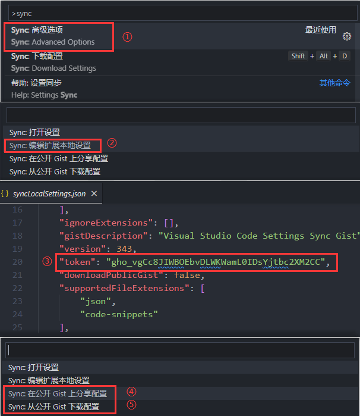
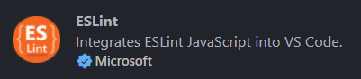
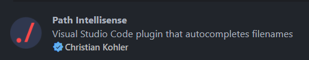
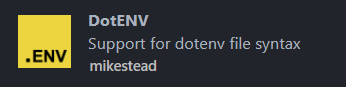
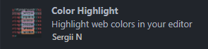
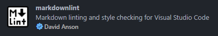
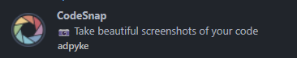
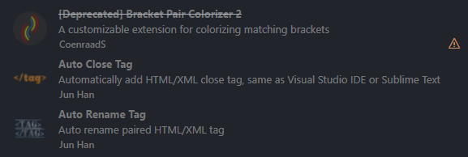

# VSCode

## 一、简介

### 1. 什么是 VSCode

VSCode（全称：Visual Studio Code）是一款由微软开发且跨平台的免费源代码编辑器。  
该软件支持语法高亮、代码自动补全（又称 IntelliSense）、代码重构、查看定义功能，并且内置了命令行工具和 Git 版本控制系统。  
用户可以更改主题和键盘快捷方式实现个性化设置，也可以通过内置的扩展程序商店安装扩展以拓展软件功能。

### 2. 官网

- [VSCode 官网](https://code.visualstudio.com/)
- [VSCode 官方文档](https://code.visualstudio.com/docs)

## 二、常用插件

### 1. 编辑器相关

- `Chinese`


- `Icons`


- `Theme`


- `Settings sync` ：配置同步，它可以将在 VSCode 上自定义的几乎所有内容同步到 Github，从设置到键盘快捷键到其他 VSCode 插件都可以同步


*注: 配置方式主要分为两部分*  
*① 在 Github上生成 Token；*
*② 在 VSCode 上登录 GitHub 账号，使用 Token；*

### 2. 功能性插件

- `Vetur` & `Volar` ：Vetur 提供了 Vue 特定的语法语义突出显示、代码片段和API语法以错误检查调试等，而Volar 是一个专为 Vue3 构建的语言支持插件


- `ESLint`



- `Prettier` 


- `EditorConfig` ：用来帮助开发者定义和维护代码风格（行尾结束符、缩进风格等），可以在项目根目录下添加.editorconfig文件，自定义一些格式化规则


- `Git Graph` ：可以查看存储库的Git图，然后从图形中轻松地执行Git操作


- `GitLens` ：可以查看代码行随时间变化的人、原因和方式以及许多其他功能


- `Path` ：引用路径自动提示



- `Open in Browser` ：提供右键菜单选项，一键在浏览器打开html文件


- `Live Server` ：开启一个实时的本地服务器，相比于open in browser每次保存文件后到浏览器都要刷新才能看到最新的变化，Live Server 可以实时监听文件的变化，自动刷新


### 3. 开发体验优化

- `Code Spell Checker` ：基本的拼写检查


- `Better Comments` ：更个性化的注释（?/!/*/todo），每种颜色都可以作为表示评论类型（注意、待办事项等）的一种方式


- `TODO Highlight` ：（TODO/FIXME）


- `Env` ：env文件内容高亮



- `Image Preview` ：鼠标悬停可以预览图片


- `Svg` ：svg文件预览，还可以转成图片进行保存


- `color HighLight` ：颜色高亮显示



- `Bookmarks` ：为代码行添加书签，尽管 VSCode 有行号，但使用 Bookmarks 添加的书签可以快速导航并来回跳转


- `markdownLint` ：markdown文件语法检查



- `CodeSnap` ：一键生成代码截图



- `Vue 3 Snippets` ：生成代码片段


- `Bracket Pair Colorizer 2`
- `Auto Close Tag`
- `Auto Rename Tag`



## 三、快捷键

### 1. 基本快捷键

#### ① 编辑器窗口相关

- `Ctrl ＋ B` 隐藏显示左侧目录栏
- `Ctrl ＋ R` 显示最近打开的文件
- `Ctrl ＋ W` 关闭当前文件
- `Ctrl ＋ Shift ＋ W` 关闭当前VSCode编辑器
- `Ctrl ＋ Shift ＋ N` 打开新的VSCode编辑器
- `Ctrl ＋ \` 编辑器界面分屏展示
- `Ctrl ＋ ~` 控制台终端隐藏与显示
- `Ctrl ＋ +/-` 缩放编辑器界面
- `Ctrl ＋ ＋ Shift ＋ P` 打开命令面板

#### ② 代码编辑相关

- `Ctrl ＋ C` 复制
- `Ctrl ＋ V` 粘贴
- `Ctrl ＋ X` 剪切
- `Ctrl ＋ Z` 撤销
- `Ctrl ＋ S` 保存
- `Ctrl ＋ F` 当前文件查找
- `Ctrl ＋ H` 当前文件替换
- `Ctrl ＋ [` 增加缩进
- `Ctrl ＋ ]` 减少缩进
- `Ctrl ＋ L` 选中当前行
- `Ctrl ＋ G` 快速定位到指定行
- `Ctrl ＋ /` 单行注释
- `Alt ＋ Shift ＋A` 多行注释
- `Alt ＋ ↑/↓` 上下移动当前行
- `Alt ＋ Shift ＋ ↑/↓` 复制并粘贴当前行
- `Home/End` 定位到当前行的行首/行尾
- `Ctrl ＋ Home/End` 定位到首行/尾行
- `Alt ＋ 鼠标左击` 创建多个光标位置

### 2. 配置代码片段

编辑器配置路径 ：文件 -> 首选项 -> 配置用户代码片段  
代码片段生成器 ：[snippet generator](https://snippet-generator.app/)

#### ① 语法

- `Example` ：当前 snippet 的名字；
- `prefix` ：前缀，代码块使用快捷方式；键入前缀，按 enter 或 tab 键，就可以使用代码块；
- `body` ：代码块内容，换行使用 \r\n；
- `description` ：键入前缀，VSCode 感知到前缀，显示的说明内容；
- `$1,$2,$3,...,$0` ：$ (占位符) 后面紧跟数字可指定代码模块生成后，编辑光标出现位置；光标位置按照从小到大排序，按tab键可切换，$0 是光标最后可切换位置；
- `${1 defaultValue}` ：给光标出现位置加上默认值；

``` json
{
  "Example": {
    "prefix": "exp",
    "body": [
        "<template>",
        "</template>",
    ],
    "description": "Example"
  }
}
```

#### ② 示例

- `vue.json`

``` json
{
  // 生成 vue2 的代码模板
  "vue2 template": {
    "prefix": "vue2Tem",
    "body": [
      "<template>",
      " <div>\n",
      " </div>",
      "</template>",
      "<script>",
      " export default {",
      "   name:'$1',",
      "   components: {\n",
      "   },",
      "   data () {",
      "     return {\n",
      "     }",
      "   },",
      "   computed:{\n",
      "   },",
      "   methods:{\n",
      "   },",
      " }",
      "</script>",
      "<style scoped>\n",
      "</style>",
      ""
    ],
    "description": "vue2 template"
  },
}
```

- `javascript.json` & `typescript.json`

``` json
{
  "console.log": {
    "prefix": "ccg",
    "body": [
      "console.log('=====',$1)",
    ]
  },

  "debugger": {
    "prefix": "ddg",
    "body": [
      "debugger"
    ]
  },

  "if": {
    "prefix": "iif",
    "body": [
      "if ($1) {",
      "  $2",
      "}"
    ]
  },

  "else if": {
    "prefix": "eef",
    "body": [
      "else if ($1) {",
      "  $2",
      "}"
    ]
  },

  "else": {
    "prefix": "eee",
    "body": [
      "else {",
      "  $2",
      "}"
    ]
  },

  "map": {
    "prefix": "mmp",
    "body": [
      "$1.map((item, idx) => {",
      "  $2",
      "  return $3",
      "})"
    ]
  },

  "forEach": {
    "prefix": "ffh",
    "body": [
      "$1.forEach((item, idx) => {",
      "  $2",
      "})"
    ]
  },

  "find": {
    "prefix": "ffd",
    "body": [
      "const $1 = $2.find(item => $3)"
    ]
  },

  "switch": {
    "prefix": "ssh",
    "body": [
      "switch($1) {",
      "  case $2:",
      "    return $3",
      "  case $4:",
      "    return $5",
      "  case $6:",
      "    return $7",
      "  case $8:",
      "    return $9",
      "  default:",
      "    return null",
      "}"
    ]
  },

  "import": {
    "prefix": "iit",
    "body": [
      "import $1 from '$2'"
    ]
  },

  "const": {
    "prefix": "cct",
    "body": [
      "const $1 = $2"
    ]
  },

  "let": {
    "prefix": "llt",
    "body": [
      "let $1 = $2"
    ]
  },

  "function": {
    "prefix": "ffn",
    "body": [
      "const $1 = ($2) => {",
      "  $3",
      "  return $4",
      "}"
    ]
  },

  // 返回上一页并调用方法
  "returnLastPage": {
    "prefix": "rrp",
    "body": [
      "function returnLastPage (){",
      "  setTimeout(() => {",
      "    // 获取当前页",
      "    let pages = getCurrentPages();",
      "    // 获取上一页",
      "    let beforePage = pages[pages.length - 2];",
      "    // 返回上一页",
      "    uni.navigateBack({",
      "    //返回成功后调用上一页的方法",
      "      success: function() {",
      "        beforePage.$vm.searchDetailList();",
      "      }",
      "    });",
      "  }, 500)",
      "}"
    ],
    "description": "returnLastPage"
  }
}
```