# Verdaccio

## 一、简介

### 1. 什么是 Verdaccio

“一个基于 Node.js 的轻量级私有仓库”。  
平时使用 npm publish 进行发布时，上传的仓库默认地址是 npm，通过 Verdaccio 工具在本地新建一个仓库地址，再把本地的默认上传仓库地址切换到本地仓库地址即可。当 npm install 时没有找到本地的仓库，则 Verdaccio 默认配置中会从 npm 中央仓库下载。

*`注：`Verdaccio 表示意大利中世纪晚期 fresco 绘画中流行的一种绿色的意思。*

### 2. 优点

- 私密性高，仅团队共享。
- 安全性高，能够有效的防治恶意代码攻击。
- 使用局域网，传输速度快。

### 3. 官网

- [GitHub](https://github.com/verdaccio/verdaccio)
- [官方文档](https://verdaccio.org/zh-cn/)

## 二、准备环境

### 1. NPM

`包管理工具`

- 常用命令

| 命令 | 描述 |
|:-----|-----|
| npm who am i | 查看当前用户 |
| npm config list | 查看源地址 |
| npm set registry url | 切换源地址 |
| npm config rm registry | 删除源地址 |
| npm login | 登录 |
| npm publish | 发布 |
| npm unpublish 包名 | 撤销发布 |

### 2. NRM

 `npm 源管理工具（可以快速切换仓库源）` 

- 安装

``` shell
# 全局安裝
npm install -g nrm
```

- 配置环境变量  

在系统变量Path中配置 nodejs的全局安装路径


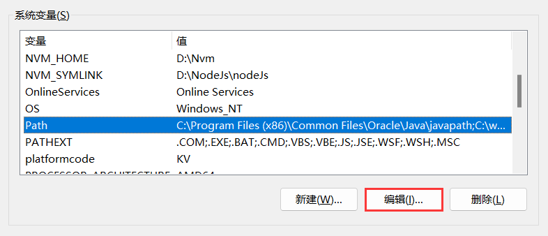

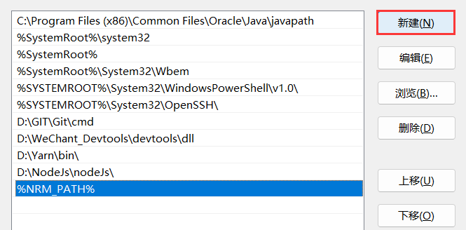

- 常用命令

| 命令 | 描述 |
|------|-----|
| nrm ls | 查看源地址 |
| nrm add registry url | 添加源地址 |
| nrm use registry | 切换源地址 |
| nrm current | 查看当前源地址 |
| nrm del registry | 删除源地址 |

### 3. PM2

`进程管理` `重启策略` `日志` `持久化`  `集群模式` `静态服务` `应用部署` `监控` `...`

- 官网

[英文网](https://pm2.io/)
[中文网](https://pm2.fenxianglu.cn/)

- 介绍

PM2 是一个守护进程管理工具，帮助您管理和守护您的应用程序。它以简单直观的 C​​LI 命令行方式进行工作。

- 安装

``` shell
# 全局安裝
npm install pm2@latest -g
yarn global add pm2
```

- 常用命令

| 命令 | 描述 |
|------|-----|
| pm2 ls | 查看进程 |
| pm2 start [app.js] | 启动某个应用 |
| pm2 stop [appName/ID] | 停止某个应用(进程名/ID) |
| pm2 restart [app.js] | 重启某个应用 |
| pm2 describe [appName] | 查看某个进程的具体情况 |
| pm2 logs [appName/ID] | 查看应用日志(进程名/ID) |
| pm2 delete [appName/ID] | 删除进程(进程名/ID) |
| pm2 stop all | 停止所有应用 |
| pm2 restart all | 重启所有应用 |
| pm2 logs | 查看实时日志 |
| pm2 logs all | 查看所有日志 |
| pm2 delete all | 删除所有进程 |

- 通过 PM2 启动 Verdaccio

``` shell
# 以管理员身份打开 cmd
# 1.直接执行，启动失败
pm2 start verdaccio

# 2.输出日志，查看报错信息
pm2 logs

# 3.正确的 pm2 执行应该拼上 verdaccio 包所在的路径
# D:\Nvm\v16.17.0\node_global\node_modules\verdaccio\bin\verdaccio
pm2 start D:\Nvm\v16.17.0\node_global\node_modules\verdaccio\bin\verdaccio
```

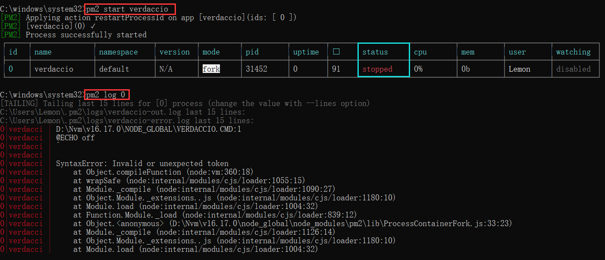

*`注：`直接运行会启动失败，可输出日志查看，是因为要执行的  verdaccio 包未找到*

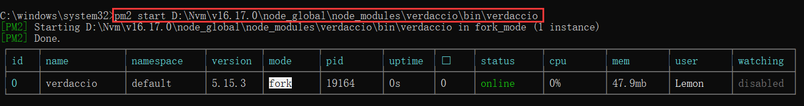

*`注：`pm2 start 后面拼上 verdaccio 包的路径，启动成功，可以访问 `http://localhost:4873/`*

## 三、安装与运行

### 1. 安装

``` shell
# 全局安装
# 本地环境 node-16.17.0 npm-8.15.0
npm install -g verdaccio
```

### 2. 运行

``` shell
# 直接使用 verdaccio 命令运行 (不建议)
verdaccio

# 使用 pm2 运行 (建议使用pm2托管)
pm2 start verdaccio
```

- 在路径 `C: \Users \Lemon \AppData\Roaming\verdaccio\` 下生成默认的配置文件 config.yaml

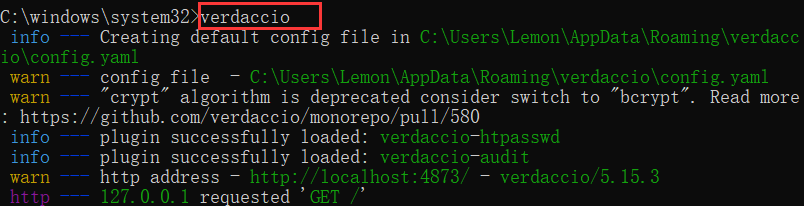

- 默认页面地址：`http://localhost:4873/`

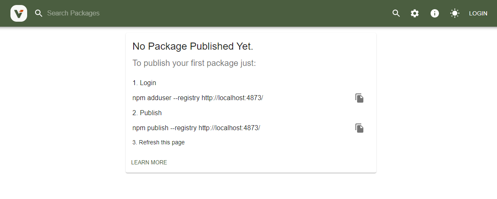

- 配置 `config.yaml` 文件后，可以通过 `http://192.168.3.7:4873/` 访问页面

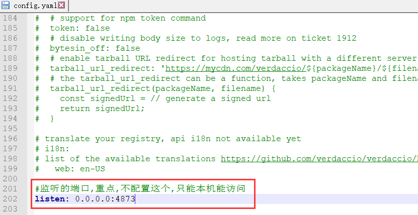

## 四、配置流程

### 1. 添加源地址

``` shell
# 查看可选源，* 代表正在使用的源
nrm ls

# 添加一个私有 npm 源，'localhost' 为自定义的源地址名称
nrm add localhost http://localhost:4873/
```

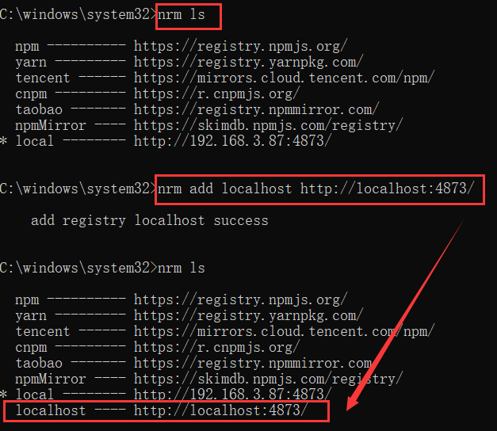

### 2. 使用源地址

``` shell
# 'localhost' 为添加源时定义的源地址名称
nrm use localhost
```

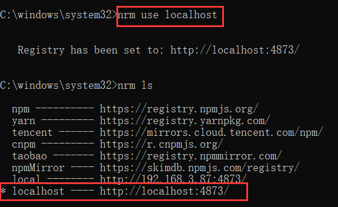

### 3. 添加用户

``` shell
# 添加 npm 用户前，需要先启动 verdaccio 服务
npm adduser --registry http://localhost:4873/
```

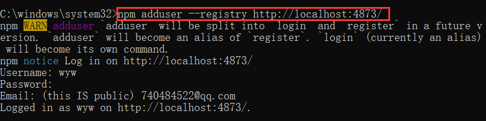

*`注：`密码不能少于8位*

## 五、发布与下载

### 1. 包


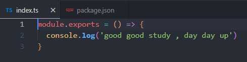

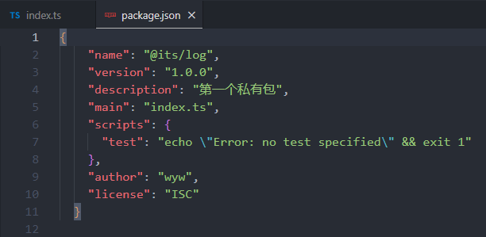

- package.json 配置

``` json
{
  // 包名
  "name" : "@its/log" ,
  // 包的版本号
  "version" : "1.0.0",
  // 包的描述信息
  "description":"私有包",
  // 入口文件
  "main" : "index.ts",
  // 以 ES Module(也就是 ES6)模块化方式进行加载：因为早期没有 ES6 模块化方案时，都是遵循 CommonJS 规范，而 CommonJS 规范的包是以 main 的方式表示入口文件的；为了区分就新增了 module 方式，但是 ES6 模块化方案效率更高，所以会优先查看是否有 module 字段，没有才使用 main 字段。
  "module": "index.ts",
  // 执行 npm 脚本命令简写
  "scripts": {
    "test" : "echo \ "Error: no test specified\ " && exit 1"
  },
  // 关键词
  "keywords" : [ "npm " ,"package" ] ,
  // 可以配置要上传 npm 的文件白名单目录
  "files" : {
    "dist"
  },
  // 开发环境下，项目所需的依赖
  "dependencies" : {},
  // 生产环境下，项目所需的依赖
  "devDependencies" : {},
  // 作者
  "author" : "wyw" ,
  // 开源许可协议：BSD ISC MIT ...
  "license" :"MIT",
  // 代码仓库地址
  "repository": {
      "type": "git",
      "url": ""
  },
}
```

### 2. 登录

``` shell
# 登录
npm login

# 验证是否登录成功，登录成功后会显示用户名
npm who i am
```

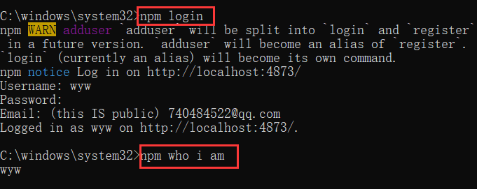

### 3. 发布

``` shell
# 发布前，需要先切换到要上传的包报所在的目录
npm publish
```

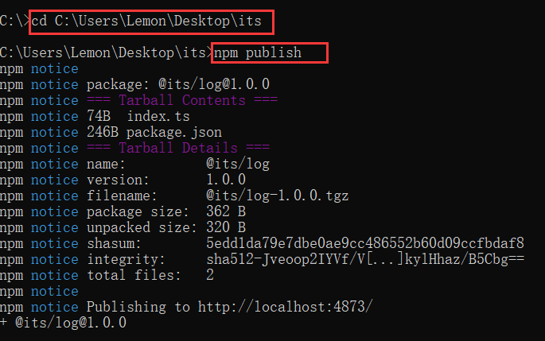

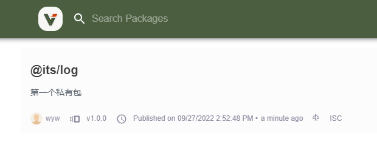

### 4. 下载

``` shell
# '@its/log' 为上传包的包名
npm install @its/log --save
```

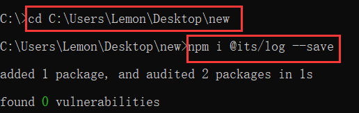

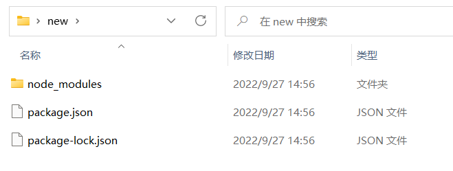

