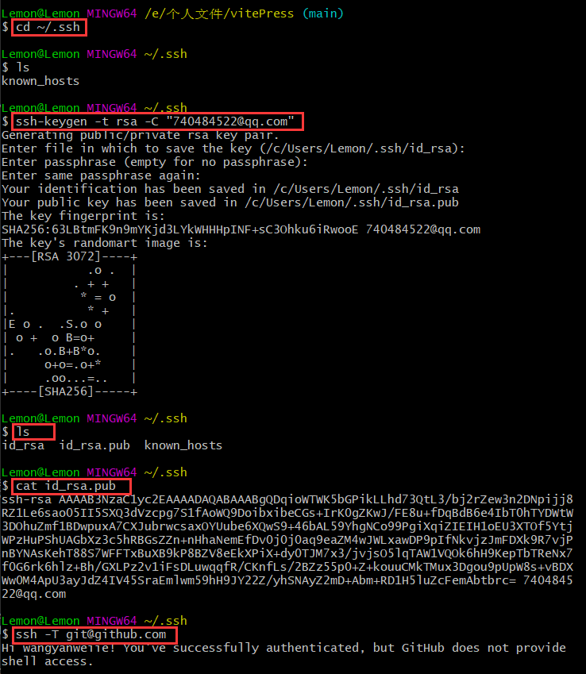

# VitePress

## 一、简介

### 1. 什么是 VitePress

“VitePress 是 VuePress 小兄弟, 基于 Vite 构建”。  

*`注：`VuePress：`https://vuepress.vuejs.org/`*

### 2. 优点

- 开发服务器启动更快
- 热更新更快
- 构建更快(内部使用 Rollup)

### 3. 官网

- [vitePress 中文网](https://vitejs.cn/vitepress)

## 二、准备环境

`pnpm` / `npm` / `yarn`

## 三、安装与运行

[官方流程](https://vitejs.cn/vitepress/guide/getting-started.html)

### 1. SSH

- 创建并进入一个目录

``` shell
# vitepress-starter 为目录名
mkdir vitepress-starter && cd vitepress-starter
```

- 初始化

``` shell
# 我选用的是 pnpm，此处选择 npm/yarn 也都可以，关于三者的区别可自行了解
pnpm init
```

- 本地安装 vitepress

``` shell
pnpm install vitepress
```

- 创建第一篇文档

``` shell
# 文档路径：docs/index.md 
# 文档内容：Hello VitePress
mkdir docs && echo '# Hello VitePress' > docs/index.md
```

- 在自动生成的 `package.json` 文件中添加一些 `script`

``` json
{
  "scripts": {
    "docs:dev": "vitepress dev docs",
    "docs:build": "vitepress build docs",
    "docs:serve": "vitepress serve docs"
  }
}
```

- 在本地服务器上启动文档站点

``` shell
# 运行之后打开 Local：http://localhost:5173/vitePress 可以看到最初始的文档站点页面
pnpm docs:dev
```

### 2. 丰富项目目录

- vitepress 目录


*`注：`默认生成的目录结构中不包含 `gitignore`  `deploy.sh` `README.md`，需要自行配置。`deploy.sh` 在项目需要部署才时会用到。*

- docs 目录


*`注：`docs 目录下所有的目录结构都需要手动创建，`.vitepress` 文件夹是必需的，以及文件夹下的 `config.ts` 文件是该项目配置的入口文件，也是必需的。其余所有文件夹都可根据个人喜好进行命名创建并使用。*

- docs 目录解析

> .vuepress/config.ts：配置文件的入口文件（必需）  
> .vuepress/dist：项目打包生成的文件夹  
> public：存放静态资源文件夹（用于存放Logo等资源）  
> guide：存放项目指南介绍的文件夹  
> note：存放笔记文档的文件夹  
> share：存放同事分享的文件夹  

### 3. 丰富配置文件

- config.ts

``` typescript
/**
 ******************** 引入导航栏与侧边栏配置 ********************
 */
import { getNavBar } from './nav'
import { 
    getSideBarGuide,
    getSideBarNoteEditor,
    getSideBarNoteFrame,
    getSideBarNoteDeploy,
    getSideBarNoteConfig,
    getSideBarShare,
} from './sidebar'

/**
 ******************** 配置信息 ********************
 */
module.exports = {
    title: 'Lemon',
    description: 'Just Do It',
    lang: 'zh-CN',
    head: [
        ['link', { rel: 'icon', href: '/favicon.png' }]
    ],
    // github pages 配置
    base: '/vitePress/',
    // 主题配置
    themeConfig: {
        // 网站 logo
        logo: '/logo.png',
        // 网站标题
        // siteTitle: false,
        // 启动页面丝滑滚动
        smoothScroll: true,
        // 社交账户链接
        socialLinks: [
            { icon: 'github', link: 'https://github.com/wangyanweiie/vitePress' },
        ],
        // 导航栏配置
        nav: getNavBar(),
        // 左侧边栏配置
        sidebar: {
            '/guide/': getSideBarGuide(),
            '/note/editor/': getSideBarNoteEditor(),
            '/note/frame/': getSideBarNoteFrame(),
            '/note/deploy/': getSideBarNoteDeploy(),
            '/note/config/': getSideBarNoteConfig(),
            '/share/': getSideBarShare()
        },
        // 右侧边栏标题
        outlineTitle: '目录',
        //上下篇文本提示文字
        docFooter: { 
            prev: '上一篇',
            next: '下一篇'
          },
        // 上次更新时间提示文字
        lastUpdatedText: 'Updated Date',
        // 编辑链接
        editLink: {
            text: 'Edit this page on GitHub',
            pattern: 'https://github.com/wangyanweiie/vitePress'
        },
        // 页面底部
        footer: {
            message: '',
            copyright: 'Copyright © 2022 wangyanwei'
        },
    }
}
```

- nav.ts（导航栏配置）

``` typescript
/**
 ******************** 顶部导航栏 ********************
 * 都是默认指向文件夹下的 index.md 文件
 */
export function getNavBar() {
    return [
        {
            text: '指南', 
            link: '/guide/' 
        },
        {
            text: '文档', 
            items: [
                { text: '编辑器/IDE', link: '/note/editor/' },
                { text: '前端技术栈', link: '/note/frame/' },
                { text: '项目部署', link: '/note/deploy/' },
                { text: '环境配置', link: '/note/config/' },
                { text: '交流分享', link: '/share/' },
            ] 
        },
    ]
}
```

- sidebar.ts（侧边栏配置）

``` typescript
/**
 ******************** 指南 ********************
 */
export function getSideBarGuide() {
    return [
        {
            text:'指南',
            collapsible: true,
            items: [],
        },
    ]
}

/**
 ******************** 笔记 ********************
 */
// 编辑器相关笔记
export function getSideBarNoteEditor() {
    return [
        {
            text:'编辑器/IDE',
            collapsible: true,
            items: [
                { text:'VSCode', link:'/note/editor/VSCode.md' },
            ],
        },
    ]
}

// 前端技术栈相关笔记
export function getSideBarNoteFrame() {
    return [
        {
            text:'前端技术栈',
            collapsible: true,
            items: [
                { text:'Element+', link:'/note/frame/Element.md' },
                { text:'Uni-app', link:'/note/frame/Uni-app.md' },
                { text:'VUE', link:'/note/frame/VUE.md' },
                { text:'JavaScript', link:'/note/frame/JavaScript.md' },
                { text:'TypeScript', link:'/note/frame/TypeScript.md' },
                { text:'GIT', link:'/note/frame/GIT.md' },
            ],
        },
    ]
}

// 项目部署相关笔记
export function getSideBarNoteDeploy() {
    return [
        {
            text:'项目部署',
            collapsible: true,
            items: [
                { text:'APP项目打包', link:'/note/deploy/APP打包.md' },
                { text:'PC项目部署', link:'/note/deploy/PC项目部署.md' },
                { text:'Verdaccio', link:'/note/deploy/Verdaccio.md' },
                { text:'VitePress', link:'/note/deploy/VitePress.md' },
            ],
        },
    ]
}

// 环境配置相关笔记
export function getSideBarNoteConfig() {
    return [
        {
            text:'环境配置',
            collapsible: true,
            items: [
                { text:'Zebra蓝牙配置', link:'/note/config/Zebra蓝牙配置.md' },
            ],
        },
    ]
}

/**
 ******************** 交流分享 ********************
 */
export function getSideBarShare() {
    return [
        {
            text:'交流分享',
            collapsible: true,
            items: [
                { text: '事件循环', link: '/share/事件循环.md' },
                { text: '文件上传', link: '/share/文件上传.md' },
                { text: 'GitLab-CI', link: '/share/GitLab-CI.md' },
            ],
        },
    ]
}
```

## 四、部署 GitHub-Pages

[官方配置流程](https://vitejs.cn/vitepress/guide/deploy.html)

### 1. 项目中的配置

- 拷贝远程仓库的通过 SSH 进行 clone 的地址


- 在项目根目录（vitepress）下创建 deploy.sh 文件

``` shell
#!/usr/bin/env sh

# 确保脚本抛出遇到的错误
set -e

# 生成静态文件
pnpm docs:build

# 进入生成的文件夹
cd docs/.vitepress/dist

# 初始化 暂存 提交
git init
git add -A
git commit -m 'deploy'

# 发布到 https://<USERNAME>.github.io/<REPO> 
# 此处即发布到我的 github 远程仓库 vitePress/gh-pages 分支上
# 注意：通过 shell 上传时需要先申请一个 ssh-key 配置到 github上，否则无法 Push 到 github。

# git remote add origin git@github.com:wangyanweiie/vitePress.git
# git branch -m main
git push -f git@github.com:wangyanweiie/vitePress.git main:gh-pages

cd -
```

- 在目录 docs/.vitepress/config.ts 中添加配置

``` typescript
module.exports = {
    ...
    // 配置正确的 base：默认为 '/' ，配置成需要部署 github-pages 远程仓库的名称
    base: '/vitePress/',
    ...
}
```

### 2. 生成 SSH-Key

- 打开 Git-Bash

``` shell
# 检查本地主机是否已经存在 SSH Key
# 查看是否存在 id_rsa 和 id_rsa.pub 文件，如果存在，说明已经存在 SSH Key
cd ~./ssh
ls

# 如果不存在ssh key，使用如下命令生成，执行后一直回车即可
ssh-keygen -t rsa -C "740484522@qq.com"
ls

# 查看 ssh key，复制输出结果到 github 上添加 SSH Key
cat id_rsa.pub

# 验证是否设置成功，设置成功后，即可不需要账号密码 Clone 和 Push 代码
ssh -T git@github.com
```

- 执行结果



### 3. 配置 GitHub

- 粘贴生成的 SSH Key 到 github 配置


### 4. 执行 deploy.sh

- 打开 Git-Bash

``` shell
ssh deploy.sh
```

- 执行结果


### 5. [站点地址](https://wangyanweiie.github.io/vitePress)

## 五、参考文章

- https://vitejs.cn/vitepress/
- https://process1024.github.io/vitepress/
- https://juejin.cn/post/6936843142293356558
- https://blog.csdn.net/weixin_42310154/article/details/118340458
