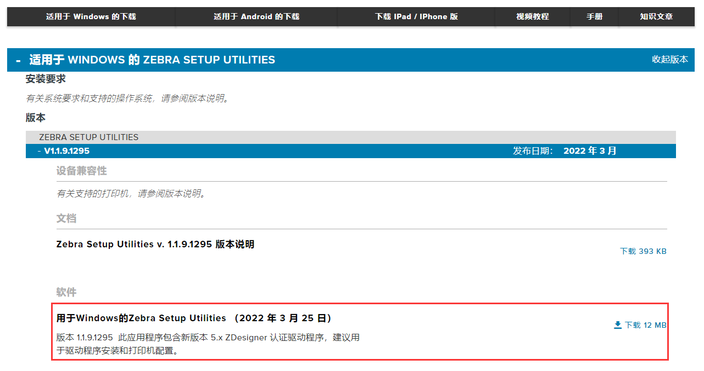
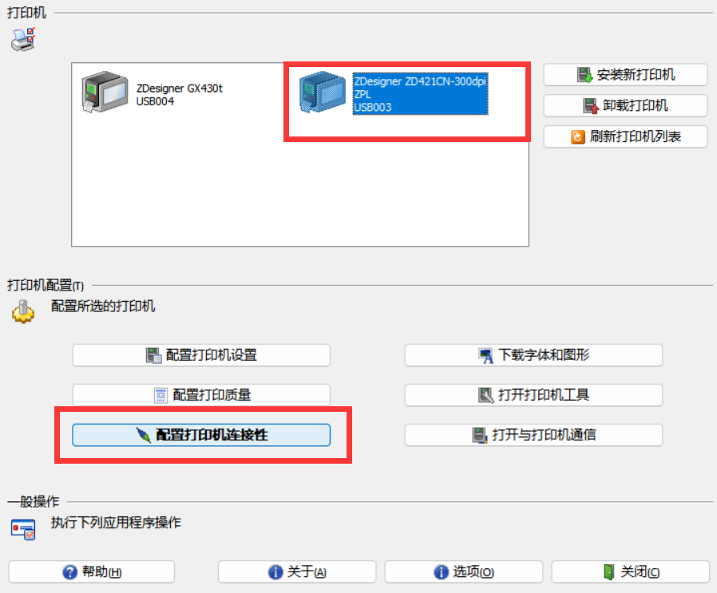

# Zebra

## 一、官网

### 1. 网址  

- [zebra](https://www.zebra.cn/cn/zh/support-downloads/printer-software/printer-setup-utilities.html)

### 2. 驱动下载

## 二、驱动配置

### 1. 驱动软件

### 2. 设置软件语言

### 3. 蓝牙配置界面

- 首先选择直连的打印机设备，进行打印机连接配置

- 选择蓝牙，点击下一步

- 进行蓝牙参数配置，一直下一步到完成

### 4. WiFi配置界面

#### 配置打印机

- 首先选择直连的打印机设备，进行打印机连接配置

- 选择无线，点击下一步

- 填写无线网络分配的IP地址信息，点击下一步

- 选择带区，点击下一步

- WLAN 国家选择中国，频道可不填（或者填 1-13），点击下一步

- 填写 ESSID（WiFi 名称），安全模式（加密方式，正常是 wpa-psk/wpa2-psk），点击下一步

- PSK 类型选择字符串，填写 PSK 名称（WiFi 密码），点击下一步

- 无线高级设置不填，一直下一步到完成

#### 添加端口

- 点击电脑右下角开始，设备与打印机，点击打印机属性 - 端口 - 添加端口

- 可用的端口类型选择 Standard TCP/IP Port，然后点击新端口

- 打印机名或 IP 地址填写上面软件里面设置的 IP 地址，然后点击下一步

- 等待检测完毕，点击下一步

- 注意设备类型，点击下一步

- 完成

- 端口配置完毕以后，选择该端口，并点击应用

#### 其他主机添加该打印机

### 5.  还原打印机设置

