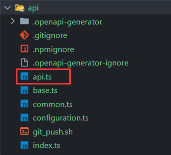
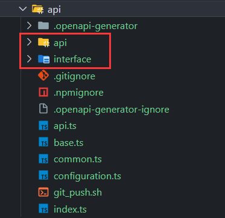

# OpenAPI Generator

- [github]('https://github.com/OpenAPITools/openapi-generator/tree/master')

## 1. 安装

- npm 全局安装

```shell
npm install @openapitools/openapi-generator-cli -g
```

- 在项目中应用

```shell
npm install @openapitools/openapi-generator-cli -D
```

## 2. 使用

- 查看使用帮助

```shell
npx openapi-generator-cli help
```

| 命令        | 说明                                        |
| ----------- | ------------------------------------------- |
| generate    | Generate code with the specified generator. |
| config-help | Config help for chosen lang                 |
| list        | Lists the available generators              |
| version     | Show version information used in tooling    |
| ...         | ...                                         |

- 查看生成接口帮助

```shell
npx openapi-generator-cli help generate
```

| 命令                         | 说明                                                         |
| ---------------------------- | ------------------------------------------------------------ |
| -c \| --config               | 配置文件路径                                                  |
| -g \| --generator-name       | 选择生成器名字                                                |
| -e \| --engine               | 选择使用哪种模版引擎生成（默认使用 `mustache模版`）              |
| -i \| --input-spec           | 接口文件的地址（可以是 `json文件` ,也可以是 `yaml文件` , 也可以是一个 url）|
| -o \| --output               | 输出的接口文件路径                                             |
| -p \| --additional-propertie | 附加属性。以 -p=name=value,name=value,... 的形式进行展示        |
| -t \| --template-dir         | 模版所在路径（默认使用 `mustache模版`）                         |
| ...                          | ...                                                          |

- 基本使用

```shell
npx openapi-generator-cli generate -i ./json/api.json -g typescript-axios -o ./api/
```

生成完成后，接口和类型都会放在 `api` 文件中，目录结构不够清晰。



按照接口和类型进行区分（使用 -p|--additional-propertie, 具体参数看[链接](https://openapi-generator.tech/docs/generators/typescript-axios)）

```shell
npx openapi-generator-cli generate -i ./json/api.json -g typescript-axios -p=withSeparateModelsAndApi=true -p=apiPackage=api -p=modelPackage=interface -o ./api/
```



- 使用配置文件生成接口

当使用 `npx openapi-generator-cli` 时，会在运行脚本的所在目录生成一个 `openapitools.json` 的配置文件：

```json
{
  "$schema": "./node_modules/@openapitools/openapi-generator-cli/config.schema.json",
  "spaces": 2,
  "generator-cli": {
    "version": "6.6.0"
  }
}
```

然后通过修改配置文件自定义自己想要的配置的生成器：

```json
{
    // 引用配置文件的架构，用于验证配置文件的正确性
    "$schema": "./node_modules/@openapitools/openapi-generator-cli/config.schema.json",
    // 定义代码缩进使用的空格数量
    "spaces": 2,
    // 配置 OpenAPI Generator CLI 的设置
    "generator-cli": {
        // CLI 工具的版本号
        "version": "6.6.0",
        // 定义使用的生成器及其配置
        "generators": {
            // 指定 OpenAPI 规范的版本
            "v2.0": {
                // 生成器的名称，决定了使用哪种语言和框架生成代码
                "generatorName": "typescript-axios",
                // 生成代码的输出目录
                "output": "./api",
                // OpenAPI 规范的输入文件路径
                "inputSpec": "./json/api.json",
                // 自定义模板的目录，用于覆盖默认模板
                "templateDir": "./template",

                // 定义额外的属性，用于定制生成的代码
                "additionalProperties": {
                    // API 服务的包名
                    "apiPackage": "api",
                    // 模型类的包名
                    "modelPackage": "interface",
                    // 是否将模型和 API 分开生成
                    "withSeparateModelsAndApi": true,
                    // 是否生成接口
                    "withInterfaces": true,
                    // 是否支持 ES6 模块
                    "supportsES6": true
                }
            }
        }
    }
}
```

`--generator-key` 就是配置文件中 `generators` 对象中的某一个key，`generators` 可以自定义多个配置，用来符合多种场景

运行脚本：

```shell
npx openapi-generator-cli generate -c ./openapitools.json --generator-key v2.0
```

忽略某些文件的自动生成（对第一次生成最有用）：

在生成代码的根目录下创建 `.openapi-generator-ignore` 文件，用法和 `.gitignore` 文件一样。然后再运行脚本。

## 3、模板文件

- [github]('https://github.com/OpenAPITools/openapi-generator/tree/master/modules/openapi-generator/src/main/resources/typescript-axios')

- 默认模板文件夹

`typescript-axios/xxx` openAPI typescript-axios 类型下全部的默认模板文件，此处罗列只作展示没有实际用途；

- 自定义模板文件夹

`template/xxx` 自定义模板文件；每个模板文件对应生成代码的不同部分：

- apiInner.mustache：实现具体的 API 方法逻辑。
- baseApi.mustache：定义 API 方法的接口。
- index.mustache：生成 API 客户端的入口文件。

*需要根据需求自行修改 `自定义模板文件夹` 中的文件。*

## 4. mustache 模版语法

``` mustache
- {{keyName}}
- {{{keyName}}}
- {{#keyName}} {{/keyName}}
- {{^keyName}} {{/keyName}}
- {{.}}
- {{!comments}}
- {{>partials}}
```

- {{keyName}}：简单的变量替换；
- {{{keyName}}}：如果keyName的值中有一些特殊字符，{{keyName}} 会将一些特殊字符进行转码，使用 {{{keyName}}} 就可以进行原样输出；
- {{#keyName}} {{/keyName}}：以 `#` 开始、以 `/` 结束表示区块，它会根据当前上下文中的键值来对区块进行一次或多次渲染。它的功能很强大，有类似 `if`、`forEach` 的功能；
- {{^keyName}} {{/keyName}}：该语法与 {{#keyName}} {{/keyName}} 类似，不同在于它是当 keyName 值为 `null`, `undefined`, `false` 时才渲染输出该区块内容；
- {{.}} {{.}}：表示枚举，可以循环输出整个数组；
- {{! }}：表示注释；
- {{>partials}}：以 > 开始表示子模块，当结构比较复杂时，我们可以使用该语法将复杂的结构拆分成几个小的子模块。
